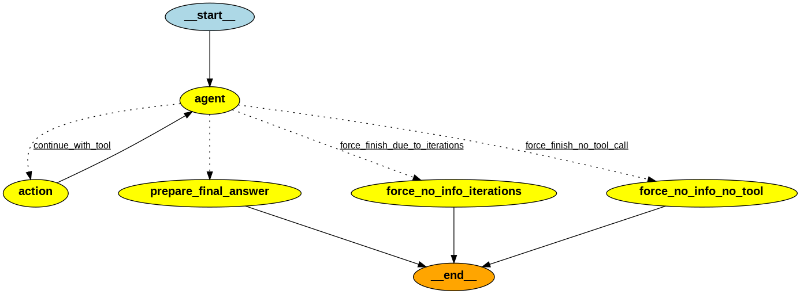

**RARSA-I**
("ReAct Reasoning Search Agent I") is an AI-powered research agent designed to automate and streamline research tasks using large language models (LLMs), advanced search, and workflow automation. It provides a modular architecture to run research pipelines, interact with search APIs, and expose a user-friendly interface via Gradio.

---

## Features

- **LLM-powered Research Workflows:** Modular graph-based system for chaining LLM-driven research steps.
- **Extensible Toolsets:** Integrates with APIs such as OpenAI, DuckDuckGo, Wikipedia, and Tavily for web search, data retrieval, and analysis.
- **Gradio Web UI:** Simple web interface for users to interact with the research agent.
- **Dockerized Deployment:** Easily run locally or in containers with provided Docker/Docker Compose files.
- **Environment-based Configuration:** All sensitive keys and settings are loaded from `.env` files.

---

## Agent Workflow Visualization



---

## Table of Contents

- [Project Structure](#project-structure)
- [Installation](#installation)
- [Configuration](#configuration)
- [Usage](#usage)
- [Development](#development)
- [API Keys](#api-keys)
- [Contributing](#contributing)
- [License](#license)
- [Links](#links)

---

## Project Structure

```
.
├── core/                 # Core logic for graph, nodes, tools, agent, prompts, and state models
│   ├── graph_builder.py
│   ├── nodes.py
│   ├── prompts.py
│   ├── research_agent.py
│   ├── state_models.py
│   ├── tools.py
├── ui/                   # Gradio interface implementation (see `ui/gradio_interface.py`)
├── main.py               # Main entry point, launches the Gradio server
├── config.py             # Loads environment variables and model/API keys
├── requirements.txt      # Python package dependencies
├── Dockerfile            # Container build instructions
├── docker-compose.yml    # Multi-container orchestration for local use
├── .env.example          # Example environment variable file
├── run.sh                # Shell script to run the app
└── LICENSE
```

---

## Installation

### Prerequisites

- Python 3.11+
- [Docker](https://www.docker.com/) and Docker Compose (optional, for containerized deployment)
- API keys for OpenAI and Tavily (see [API Keys](#api-keys))

### Local Installation

1. **Clone the repository:**
   ```bash
   git clone https://github.com/EdwardMaievskyi/RARSA_I.git
   cd RARSA_I
   ```

2. **Create and configure your `.env` file:**
   ```bash
   cp .env.example .env
   # Edit .env and add your API keys and desired settings
   ```

3. **(Recommended) Create a virtual environment if you're going to run the app locally without containerization:**
   ```bash
   python -m venv venv
   source venv/bin/activate
   ```

4. **Install dependencies:**
   ```bash
   pip install -r requirements.txt
   ```

5. **Run the application:**
   ```bash
   python main.py
   ```
   or execute the run.sh script:
   ```bash
   ./run.sh
   ```

   The Gradio interface will be available at [http://127.0.0.1:7860](http://127.0.0.1:7860) by default.

### Docker Deployment

1. **Ensure your `.env` file is ready.**
2. **Build and run via Docker Compose:**
   ```bash
   docker-compose up --build
   ```
   This will start the agent on [http://127.0.0.1:7860](http://127.0.0.1:7860).

---

## Configuration

All configuration is managed via environment variables. Use the `.env.example` as a template.

**Main options in `.env`:**
- `OPENAI_API_KEY` - Your OpenAI API key
- `TAVILY_API_KEY` - Your Tavily API key
- `GRADIO_HOST`, `GRADIO_PORT` - UI host and port
- `GRADIO_SHARE` - Set to `true` to share the UI externally (default: false)
- `LOG_LEVEL` - Logging level (INFO, DEBUG, etc)
- See `.env.example` for all options.

---

## Usage

- Access the Gradio UI at the configured host/port.
- Interact with the research agent by entering your research queries.
- The agent will use LLMs and web search to automate multi-step research tasks.

---

## API Keys

RARSA-I requires valid API keys for external LLM and search engines:

- **OpenAI:** Obtain from https://platform.openai.com/account/api-keys
- **Tavily:** Obtain from https://app.tavily.com/

Set these keys in your `.env` file:
```dotenv
OPENAI_API_KEY=your_openai_key
TAVILY_API_KEY=your_tavily_key
```

---

## Development

- The main entrypoint is `main.py` (loads `ui/gradio_interface.py`).
- Core research logic and pipeline orchestration is in the `core/` directory.
- Add new tools, prompts, or agent logic by extending relevant files in `core/`.
- For rapid testing, use `run.sh` for a quick start.

---

## Contributing

Contributions, suggestions, and issues are welcome! Please open an issue or submit a pull request.

---

## License

This project is licensed under the terms of the [LICENSE](LICENSE) file.

---

## Links

- [GitHub Repository](https://github.com/EdwardMaievskyi/RARSA_I)
- [BeautifulSoup](https://beautiful-soup-4.readthedocs.io/en/latest/)
- [DuckDuckGo](https://duckduckgo.com/)
- [Wikipedia API](https://github.com/goldsmith/Wikipedia)
- [Gradio Documentation](https://www.gradio.app/)
- [OpenAI API](https://platform.openai.com/)
- [Tavily API](https://app.tavily.com/)
- [Docker](https://www.docker.com/)
- [Docker Compose](https://docs.docker.com/compose/)
